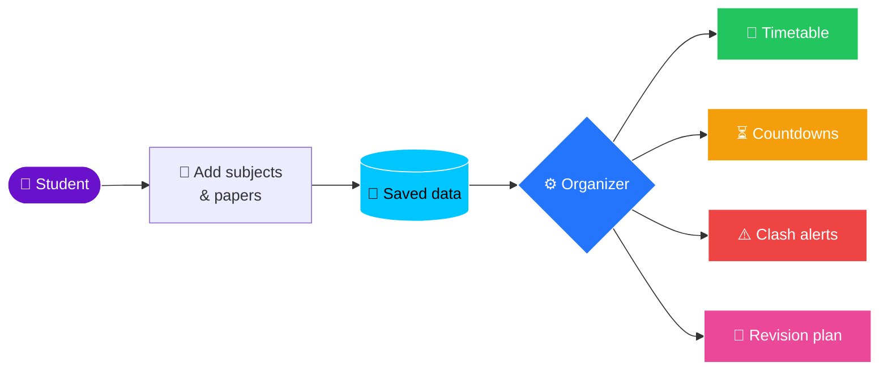

<!-- ============================== HEADER ============================== -->
<div align="center">


<a href="https://git.io/typing-svg"></a>

<br/>


</div>

---

## 🧭 Table of Contents

- [✨ About](#-about)
- [🚀 Features](#-features)
- [🗺️ How It Works](#️-how-it-works)
- [📂 Project Structure](#-project-structure)
- [⚙️ Installation](#️-installation)
- [🎮 Usage](#-usage)
- [🛣️ Roadmap](#️-roadmap)
- [❓ FAQ](#-faq)
- [🤝 Contributing](#-contributing)
- [📜 License](#-license)

---

## ✨ About

> **Exam Organizer** is a Python app that helps **IGCSE** and **A-Level** students keep track of the whole exam season in one place. It covers every subject, every paper and every date, with countdowns, clash detection and revision planning.

<table>
<tr>
<td width="33%" align="center">
<h3>📅</h3>
<b>Organize</b><br/>
<sub>All your papers and dates in one tidy timetable</sub>
</td>
<td width="33%" align="center">
<h3>⏳</h3>
<b>Count Down</b><br/>
<sub>Know exactly how many days you have left</sub>
</td>
<td width="33%" align="center">
<h3>🧠</h3>
<b>Revise Smart</b><br/>
<sub>Plan revision around your real exam schedule</sub>
</td>
</tr>
</table>

---

## 🚀 Features

| Status | Feature | Description |
|:---:|---|---|
| 🟡 | **Subject & paper management** | Add subjects (e.g. `0625 Physics`, `9709 Maths`) and their components |
| 🟡 | **Exam timetable** | Store date, time, duration and session for every paper |
| 🟡 | **Countdowns** | See the days remaining until each exam |
| 🟡 | **Clash detection** | Get a warning when two papers overlap |
| ⚪ | **Revision planner** | Build a study schedule leading up to each exam |
| ⚪ | **Past-paper tracker** | Log your scores and track progress over time |
| ⚪ | **GUI** | A friendly graphical interface |

<sub>🟢 Done &nbsp;•&nbsp; 🟡 In progress &nbsp;•&nbsp; ⚪ Planned</sub>

<details>
<summary><b>📘 Supported qualifications & series (click to expand)</b></summary>
<br/>

| Qualification | Levels | Exam Series |
|---|---|---|
| 🟣 **IGCSE** | Core / Extended | Feb/March · May/June · Oct/Nov |
| 🩷 **A-Level** | AS · A2 | Feb/March · May/June · Oct/Nov |

</details>

---

## 🗺️ How It Works



---

## 📂 Project Structure

<details>
<summary><b>🌳 View folder tree</b></summary>
<br/>

```text
Exam-Organizer/
├── 📄 README.md
├── 📄 LICENSE
├── 📄 .gitignore
├── 📁 src/
│   └── 📁 exam_organizer/
│       ├── 🐍 main.py          # Entry point
│       ├── 📁 models/          # Subject, Paper, Exam
│       ├── 📁 services/        # Scheduling, clashes, countdowns
│       ├── 📁 storage/         # Saving & loading data
│       └── 📁 ui/              # CLI / GUI
├── 📁 data/                    # User & reference data
└── 📁 tests/                   # Unit tests
```

</details>

> [!NOTE]
> The structure above is the planned layout. It will change as the project grows.

---

## ⚙️ Installation

> [!IMPORTANT]
> You need **Python 3.10 or newer**.

<details open>
<summary><b>🪟 Windows</b></summary>

```bash
git clone https://github.com/<your-username>/Exam-Organizer.git
cd Exam-Organizer
python -m venv .venv
.venv\Scripts\activate
pip install -r requirements.txt
```

</details>

<details>
<summary><b>🍎 macOS / 🐧 Linux</b></summary>

```bash
git clone https://github.com/<your-username>/Exam-Organizer.git
cd Exam-Organizer
python3 -m venv .venv
source .venv/bin/activate
pip install -r requirements.txt
```

</details>

---

## 🎮 Usage

```bash
python -m exam_organizer
```

> [!TIP]
> Usage examples and screenshots will be added here once the first version is ready. 📸

---

## 🛣️ Roadmap

- [ ] 🧱 Core data models (Subject, Paper, Exam)
- [ ] 💾 Save and load exams (JSON)
- [ ] 🖥️ Command-line interface
- [ ] ⏳ Countdown to each exam
- [ ] ⚠️ Clash detection
- [ ] 🧠 Revision planner
- [ ] 📊 Past-paper score tracker
- [ ] 🎨 Graphical interface

---

## ❓ FAQ

<details>
<summary><b>Which exam boards are supported?</b></summary>
<br/>
The focus is on Cambridge (CAIE) IGCSE and A-Level. Other boards, such as Pearson Edexcel, may come later.
</details>

<details>
<summary><b>Does it handle Cambridge timezone variants?</b></summary>
<br/>
This is planned. Papers can have different dates depending on your administrative zone.
</details>

<details>
<summary><b>Is it free?</b></summary>
<br/>
Yes. It's open source under the MIT License. 🎉
</details>

---

## 🤝 Contributing

Contributions, ideas and bug reports are welcome! 💡

1. 🍴 Fork the repo
2. 🌿 Create a branch: `git checkout -b feature/amazing-feature`
3. 💾 Commit your changes: `git commit -m "Add amazing feature"`
4. 🚀 Push: `git push origin feature/amazing-feature`
5. 🔃 Open a Pull Request

---

## 📜 License

Distributed under the **MIT License**. See [`LICENSE`](LICENSE) for details.

<!-- ============================== FOOTER ============================== -->
<div align="center">

<br/>

**Made with ❤️ and ☕ for students surviving exam season**

⭐ *If this helps you, consider giving it a star!* ⭐


</div>
